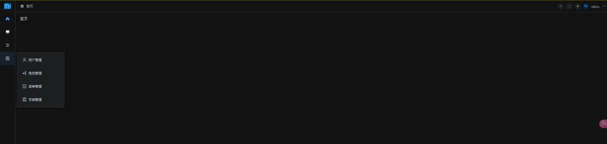
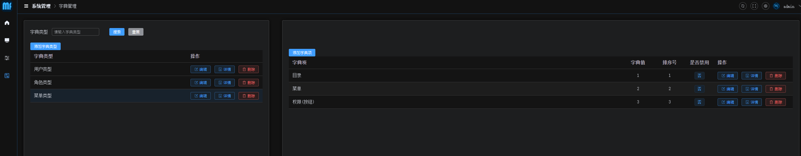
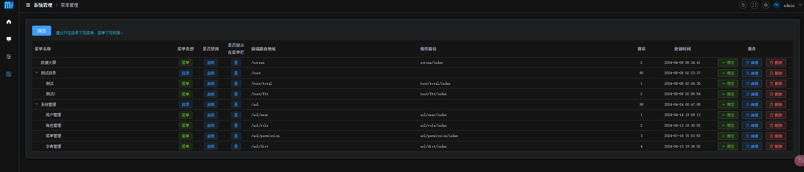

# matrix-basic

#### 介绍
个人练习使用的初始化项目

#### 软件架构
软件架构说明

JDK21

SpringBoot 3.2.2

sa-token 权限校验

Mybatis-flex

knife4j 接口文档

postgresql

#### 前端部分

https://gitee.com/liu-weizhong/matrix-basic-vue3

#### 效果图

##### 登录页

##### 主页




#### 代码提交规范

```
[init] 初始化
[feat] 增加新功能
[fix] 修复问题/BUG
[perf] 优化/性能提升
[refactor] 重构
[revert] 撤销修改
[style] 代码风格相关无影响运行结果的
[update] 其他修改
[upgrade] 升级版本
```


#### 特技

1.  使用 Readme\_XXX.md 来支持不同的语言，例如 Readme\_en.md, Readme\_zh.md
2.  Gitee 官方博客 [blog.gitee.com](https://blog.gitee.com)
3.  你可以 [https://gitee.com/explore](https://gitee.com/explore) 这个地址来了解 Gitee 上的优秀开源项目
4.  [GVP](https://gitee.com/gvp) 全称是 Gitee 最有价值开源项目，是综合评定出的优秀开源项目
5.  Gitee 官方提供的使用手册 [https://gitee.com/help](https://gitee.com/help)
6.  Gitee 封面人物是一档用来展示 Gitee 会员风采的栏目 [https://gitee.com/gitee-stars/](https://gitee.com/gitee-stars/)
